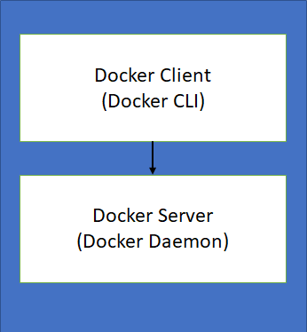

# Docker Installation

Inside docker there are two very important tools  

## Windows Docker Installation 

For Windows Home user, you will not be able install the Docker for Windows Desktop edition, as it requires Hyper-V virtualization. This is supported only by Windows Professional and Enterprise editions.

1. Enable Virtualization  
You may need to enable virtualization in your computer's BIOS settings.       
To check if the Virtualization is enabled or not  
a. Go to `Task Manager`  
b. Select `Performance`   
c. Check if `Virtualization` is marked enabled or not   

    

## Liuns Docker Installation

1. Docker Installation

    Update the system

        sudo yum check-update
        curl -fsSL https://get.docker.com/ | sh
    Expected output after the installation command. Start the Docker
2. To start the docker

        systemctl start docker
        systemctl enable docker
    To check the status of the docker, if started or not 

        systemctl status docker