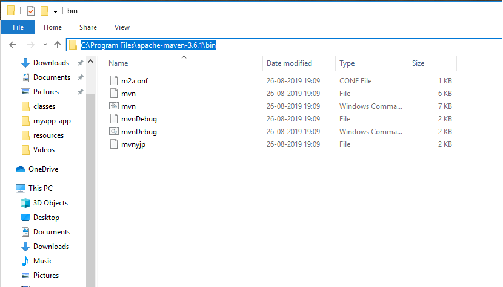
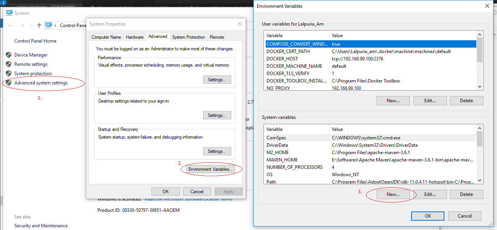
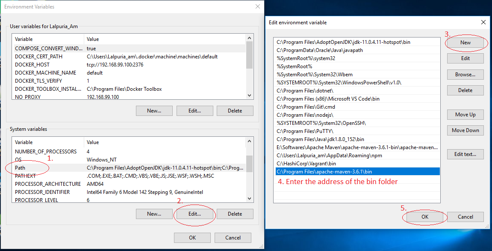

# Maven Installation on Windows
## Installtion

1. Open terminal check for the Java version if the Java is installed or not, if not please install it.

        java version
2. After Java Installation, to download Maven visit to Apache Maven Download page (https://maven.apache.org/download.cgi)
3. Download the Maven.
4. Unzip the downloaded folder, go to the bin folder inside the unzip folder.

5. Copy the address of the folder.

6. Right Click on My Computer 
7. Select the Advanced System Setting
8. Click on Environment Variables...

9. Add New System Variable
10. Add Variable Name as "MAVEN_HOME"

11. Add Variable value as the copied address
12. Then find the `path` in System Variable, Click Edit
13. Click New, paste the address copied last and Click Ok

14. Now open a fresh Command Prompt 
15. Now try maven --version

Here we are done with the Maven Installation.

