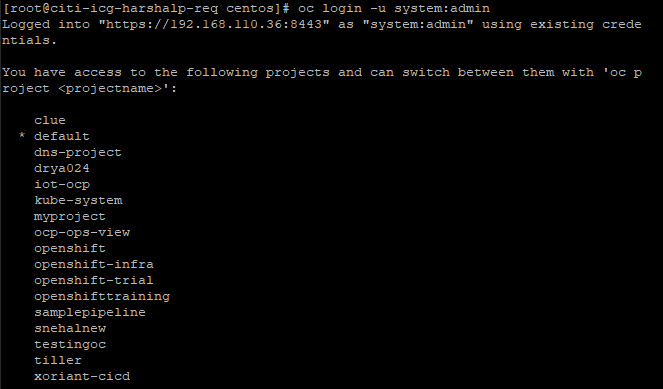
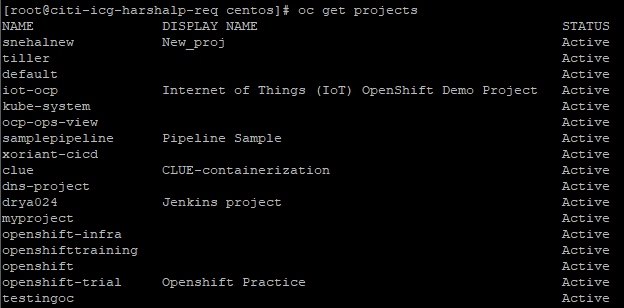
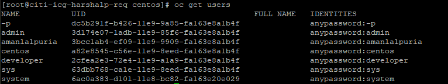

# Users

Openshift comes with 3 types of users.
1. Regular - are developer who intract with openshift
2. System - system:admin
            system:master
            user for system administrator like for clustering, poding
3. Service - which can be created as per the different project requirement, as for DB and different.

Openshift consist of inbuild `OAuth Server` - use for authentication for users.

**DenyAll** helps to block all unauthorized access of the users.

We can create `new users` in the file :- 

    /etc/openshift/master/master-config.yaml

 
To check the enabled users

    oc get users

To give user admin rights

    oc adm policy add-cluster-role-to-user cluster-admin administrator

## CLI Commands

1. To login using CLI in openshift

        oc login - u system:admin

    This will list out all the projects created by all the users on the CLI

    

2. To list out all the projects and details about the same we can use:

        oc get projects

    

3. To get all the users details we can use:
        oc get users
    
    

    Here in the details password is mentioned as `Any Password`. Any Password means that any password for the user can get the access.

4. To give admin rights to the newly created user we can use:

        oc adm policy add-cluster-role-to-user cluster-admin administrator cluster role "cluster-admin" added:"amanlalpuria"