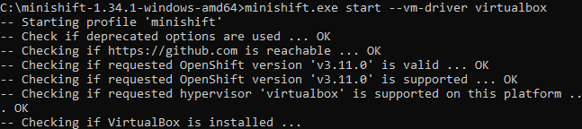

# Minishift

1. Must have Oracle Virtual box installed

2. Download `Minishift` from [https://www.okd.io/minishift/](https://www.okd.io/minishift/) as per the enviroment Linux/Windows.

3. Extract the downloaded folder and paste it in the C:/

4. Open terminal and go to Minishift directory.
    
        C:\minishift-1.34.1-windows-amd64

5. Run the command 

        minishift.exe start --vm-driver virtualbox

    It will download the required files.
    